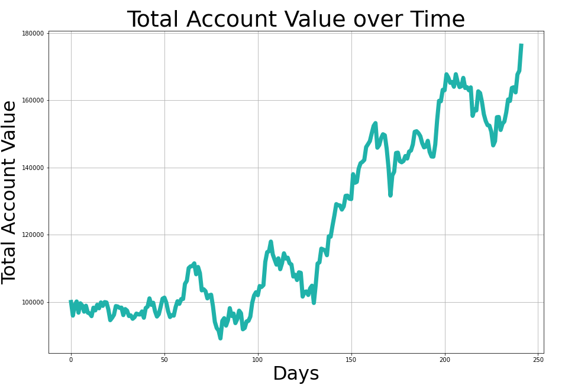

# Learn the trends in stock price using Q-Learning algorithm of Reinforcement learning.

## Overview
### Learn the trends in stock price and perform a series of trades over time and end with a profit using Q-Learning algorithm for reinforcement learning. In each trade the agent can take the actions: buy/sell/hold and the agent will start with an investment capital of $100000. The agent needs to be trained to learn the trends in stock price and perform a series of trades.

## Dataset
### The dataset provided is a historical stock price for Nvidia for the last 5 years. The dataset has 1258 entries starting 10/27/2016 to 10/26/2021. The features include information such as the price at which the stock opened, the intraday high and low, the price at which the stock closed, the adjusted closing price, and the volume of shares traded for the day.

## Implementation
Used the Gym toolkit for developing a reinforcement learning algorithm. The environment consists of the following methods:
* Init method: this method initializes the environment.
* Reset method: This method resets the environment and returns the observation. The observation is an integer in the range of 0 to 3 representing the state space. The observation depends upon whether the price increased on average in the number of days the agent considers, and whether the agent already has the stock or not. If the task is to train the agent the maximum timesteps will be equal to the number of days considered subtracted from the length of the training stock data. If the task is to evaluate the trained agent's performance the maximum timesteps will be equal to the number of days considered subtracted from the length of the testing stock data.
* Step method: This method implements what happens when the agent takes the action to Buy/Sell/Hold. It takes the parameter as action and returns the observation representing four possible states that the agent can receive, Reward - Integer/Float value that's used to measure the performance of the agent, done - Boolean describing whether or not the episode has ended, info- a dictionary that can be used to provide additional implementation information. It gives the agent a penalty for taking actions such as buying a stock when the agent doesn't have the investment capital and selling a stock when the agent doesn't have any shares.

* render method: This method renders the agent's total account value over time.

## Q-learning Implementation
Implemented a Q-Learning algorithm to the stock trading environment to generate the trading strategy for maximizing the agent's total account value over time. Following are the details of the methods:
* init method: This method instantiates the Q-learning parameters. first, it initializes the environment instance, then creates a table of dimension observation space x action space, a list of reward values for each episode, a list of episodes, epsilon value for epsilon greedy algorithm, epsilon decay factor to decay the epsilon value gradually,
min epsilon value to hold the decay till this value, discount factor - gamma for exploration, learning rate for the training task.
* train method: This method implements the Q-learning algorithm and trains the model. Iterates over 2000 episodes and initializes a state by calling the reset method of environment-class. initializes the reward to 0 and done to False. Next, it iterates over a while loop till the done flag is true and in each iteration, it first chooses an action depending on the epsilon value. If the epsilon value is high it chooses the action randomly from the environment action space hence try to explore, if epsilon is small, it chooses the action greedily by taking maximum action value for the state. Next, it calls the step function of the environment on the action chosen earlier and fetches the next state, reward, done flag, and info. Once getting these values, it fetches the maximum value action from the q table for the next state got from the step function. It then updates the qtable. Next, we add the reward value to the reward value so for this episode and break the loop if the done flag is True. We store the total reward for the episode and episode value in the list and decay the epsilon value by multiplying with the decay factor.
* evaluate method: This method evaluates the trained agent's performance by selecting only the greedy/best
action in each state.
* plot method: this method plots the reward dynamics and epsilon decay during training.

## Plot:

# Author 
 * [Harshit Monish](https://github.com/harshitmonish)
